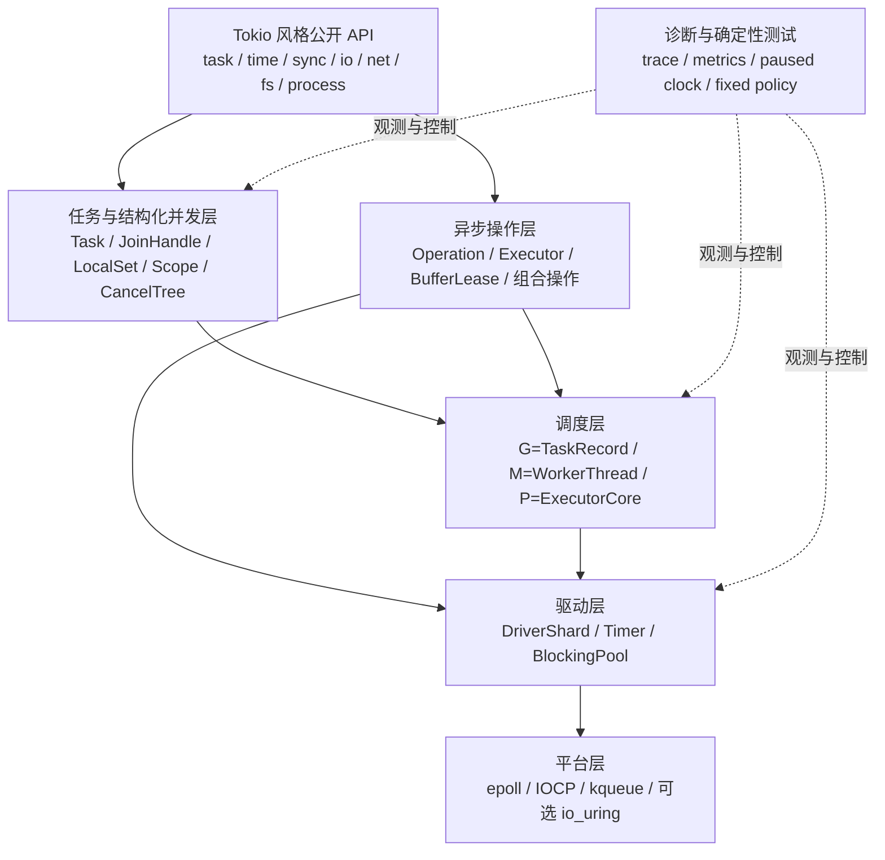
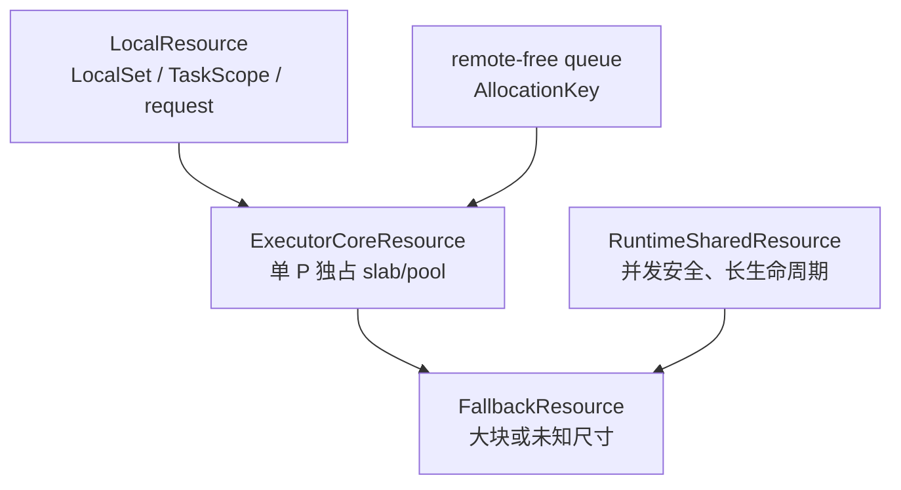

# CIO 运行时总体蓝图

## 1. 设计结论

CIO 采用“Tokio 定义语义、Go 定义执行资源、zio 提供调度优化、Asio 定义异步
操作内核”的组合架构：

- 公开 API、取消、关闭、背压、公平性与任务行为以固定 Tokio 基线为准；
- 多线程调度采用经过 C++20 改造的 G/M/P 模型；
- 自适应 I/O 轮询、有限 searcher、负载回迁和 task group 吸收自
  `lalinsky/zio`；
- executor、关联上下文、组合操作、buffer sequence 与平台后端隔离吸收自 Asio；
- C++20 无法像 Rust 完整证明 `Send`/`Sync`，因此增加 owned spawn 边界、默认
  拒绝型 trait、静态检查、运行时 affinity 检查和 `LocalSet`，不伪造不存在的
 语言保证；
- 所有核心引用都使用拥有句柄或 generation key，公开 API 和核心所有权路径
  不使用裸指针。

内部实现允许优于 Tokio，但不得破坏 Tokio 的可观察语义。新增的结构化并发、
严格 owned spawn 和诊断能力作为 CIO 安全扩展，不能冒充 Tokio 原有行为。

## 2. 参考来源的职责边界

| 来源 | CIO 吸收内容 | 不照搬内容 |
| --- | --- | --- |
| Tokio 1.53.1 | API、task、JoinHandle、LocalSet、sync、channel、time、I/O、取消、关闭和公平性契约 | Rust 语法、依赖编译器自动证明的所有权实现 |
| Go runtime | G/M/P、每 P 队列、runnext、全局公平检查、工作窃取、netpoll、timer、worker 停放与诊断 | 可增长 goroutine 栈、GC 耦合、信号式异步抢占 |
| lalinsky/zio | 自适应 event budget、有限 searcher、idle mask、防丢唤醒、负载回迁、task group、blocking pool 关闭次序 | 栈式 fiber、虚拟内存栈、裸指针侵入式结构、Zig 上下文切换 ABI |
| Asio | executor/执行上下文分离、关联 executor/allocator/cancel、组合操作、串行执行、buffer sequence、RAII、epoll/IOCP/kqueue 隔离 | handler-first 公开接口、以 `io_context.run()` 代替 task scheduler |

优先级固定为：内存与并发正确性 > Tokio 语义 > 跨平台一致性 > 可测试与可诊断 >
可复现的性能优化。

## 3. 总体分层



公开层只能依赖稳定抽象，平台差异停留在 driver/platform。平台后端可替换，不能
改变公开的错误、取消、部分完成、EOF、timeout 和关闭语义。

## 4. Task 与 C++20 安全边界

### 4.1 Task 本身

`Task<T>` 是 lazy、move-only、唯一拥有协程帧的计算值。创建 `Task` 不执行用户
代码；第一次 poll 只能由 runtime 排队触发，`spawn` 不允许在调用栈中同步 poll。

Task 的核心元数据包括：

- `TaskKey { slot, generation, runtime_nonce }`；
- 唯一 owning coroutine wrapper；
- 生命周期与调度位；
- 取消来源与 cancellation shield 计数；
- join 结果和 join waiter；
- task-local、deadline、trace context；
- cooperative budget；
- mobility 与 affinity 信息。

### 4.2 `spawn` 对齐 `Send + 'static`

Rust 可以检查整个 Future 是否满足 `Send + 'static`，C++20 不能检查协程帧中的
所有局部变量。CIO 使用下列组合方案：

1. `cio::task::spawn` 的首选入口是 captureless owned factory 与显式拥有参数；
2. 所有跨线程入口参数必须满足 `cio::Send`，未知用户类型默认不满足；
3. 跨线程共享包装必须要求被共享对象满足 `cio::Sync`；
4. 禁止裸引用、`reference_wrapper`、裸指针和隐式捕获进入 portable task；
5. CIO 自有 awaitable 明确声明 portable 或 local；
6. clang-tidy 检查协程捕获、普通 `thread_local`、已知 thread-affine 类型和
   guard 跨 await；
7. Debug/TSan 构建记录 task poll owner，检测并发 poll 和 affinity 违规；
8. 用户对自定义 `Send`/`Sync` 的 opt-in 是安全承诺，必须有文档和测试。

概念上的入口形式如下：

```cpp
auto handle = cio::task::spawn(cio::task::owned(
    [](cio::Shared<State> state, Request request) -> cio::Task<Response> {
        co_return co_await handle_request(std::move(state), std::move(request));
    },
    std::move(state),
    std::move(request)));
```

`owned` 在目标 runtime 内创建协程帧，从根源上减少“先在外部线程创建含悬空引用
的帧，再把它搬入 runtime”的问题。为了 Tokio 能力对齐，可提供接受已审计
portable task 的重载，但其安全要求必须完全相同。

portable task 在暂停后允许迁移。调度器通过 release/acquire 发布确保同一 task
的顺序执行产生 happens-before；任何时刻最多一个 worker poll 它。

### 4.3 `spawn_local` 与 `LocalSet`

`spawn_local` 接受 local task，必须在绑定单一 OS 线程的 `LocalSet` 上执行：

- task 从第一次 poll 到析构都在同一线程；
- local ready queue 不参与工作窃取；
- 允许 thread-affine 和不满足 `Send` 的对象；
- 跨线程只能向它发送拥有消息或 wake 请求，不能在其他线程 poll；
- `LocalSet` 的关闭必须 cancel-and-drain 所有本地 task 后才能解绑线程。

`SerialExecutor` 与 `LocalSet` 不同：前者只保证 handler/task 不并发，可跨线程
串行执行；后者保证线程身份不变。

### 4.4 动态 pin

CIO 自带的 thread-affine 资源在 portable task 中使用时必须二选一：

- 编译期拒绝；
- 获取 `AffinityLease`，把 task 固定到当前 `ExecutorCore`，直到所有 lease
  释放。

动态 pin 是性能/兼容补充，不替代 `LocalSet` 的同一 OS 线程保证。普通用户类型
无法自动识别时，仍由 `Send` opt-in 和静态检查承担责任。

## 5. G/M/P 执行模型

### 5.1 对应关系

| Go 概念 | CIO 概念 | 职责 |
| --- | --- | --- |
| G | `TaskRecord` | 协程、状态、取消、join、task-local、预算 |
| M | `WorkerThread` | OS 线程，执行 poll、driver poll 与调度循环 |
| P | `ExecutorCore` | 本地队列、runnext、driver/timer shard、缓存与指标 |

`ExecutorCore` 数量等于有效并行度。有效并行度综合：

- 用户显式 worker 配置；
- CPU affinity；
- Linux cgroup CPU quota/cpuset；
- Windows Processor Group/Job Object/affinity；
- macOS 可用 CPU 信息；
- 最小值与上限。

正常 `WorkerThread` 必须持有一个 `ExecutorCore` 才能 poll portable task。worker
阻塞或执行 `block_in_place` 时把 core 交给备用 worker，从而避免阻塞整个 P。
普通阻塞 API、文件系统、DNS 和长 CPU 任务进入独立 blocking/CPU executor。

### 5.2 每 P 数据

每个 `ExecutorCore` 拥有：

- 容量 256 的本地 MPMC/MPSC 语义环形 ready queue；
- 一个 runnext/LIFO 槽；
- remote inbox；
- timer shard；
- reactor shard 或 completion batch；
- 小对象内存资源与 Task/Operation slot 缓存；
- 随机源、EWMA poll cost 和调度预算；
- 队列、steal、I/O、timer 与 park 指标。

具体容量属于可基准调优参数，不属于公开语义；默认 256 与 Tokio/Go 的成熟实现
接近，便于建立首个基线。

### 5.3 一轮调度

worker 按以下顺序工作，但全局/I/O 检查由硬上限保证，不能被本地任务永久推迟：

1. 消费 runnext/LIFO 槽；
2. 消费本地 ready；
3. 到达 global budget 时，从全局注入队列取公平批次；
4. 到达 event budget 时非阻塞 poll driver/timer；
5. 无本地工作时再次检查全局、timer、I/O；
6. 随机选择 victim，窃取约一半 portable ready task；
7. 成为受限 searcher，检查其他 P；
8. 最终检查后登记 idle 并进入内核等待。

runnext 用于刚唤醒的直接依赖，改善 cache locality，但同一 task 链连续使用达到
上限后必须回到普通队列，避免乒乓任务饿死其他工作。

本地队列溢出时把一批 task 注入全局队列，不允许静默丢弃。外部线程 spawn/wake
默认进入 remote inbox 或全局注入队列。

### 5.4 公平性和自适应预算

调度器同时维护三类预算：

- task cooperative budget：限制单 task 连续完成 CIO async 操作的次数；
- event budget：限制两次 I/O/timer poll 之间的 task poll 数量或时间；
- global budget：限制两次全局注入队列检查之间的时间。

首版采用固定值建立正确性基线；后续使用 task poll cost 的 EWMA 自适应：

- event budget 目标延迟初值约 100 微秒，范围 2..8192 次 poll；
- global budget 目标初值约 10 毫秒；
- 任一预算同时受“次数硬上限”和“时间硬上限”约束；
- `SchedulerPolicy::fixed` 关闭 EWMA、随机 victim 与负载回迁，供差分和确定性测试；
- 自适应值、命中上下限次数和实际延迟全部暴露为 metrics。

这些初值不是性能结论，只有跨平台 benchmark 后才能调整。

### 5.5 searcher、停放与防丢唤醒

只允许少量 worker 标记为 searching/spinning，避免所有空闲线程同时扫描所有 P。
实现至少维护：

- searching worker 计数；
- idle core/worker 位图；
- 全局工作发布序列；
- 每个 core 的 remote inbox 序列。

发布方遵循：

1. release 发布 task 或 completion；
2. 更新 work sequence；
3. 若无 searcher，选择一个 idle worker 唤醒。

停放方遵循：

1. 宣告不再 searching；
2. acquire/必要处 seq_cst 重新读取全部工作来源与 sequence；
3. 确认无工作后登记 idle；
4. 再做一次防竞态检查；
5. 才进入内核等待。

该协议必须用状态机模型测试、随机调度压力和 ThreadSanitizer 验证。不能仅凭注释
声称不会丢唤醒。

### 5.6 工作窃取与负载回迁

- 只窃取 portable queue，永不窃取 LocalSet 队列；
- victim 随机选择，避免所有 thief 冲击同一队列；
- 默认窃取约一半，当前 worker 立即运行一个，其余放本地；
- I/O completion 优先回到 task 最近运行的 core；
- 若某个 driver/core 的 ready、active I/O 或排队延迟持续超过阈值，有限比例的
  portable wake 转入全局队列；
- 回迁每轮有 quota 和冷却期，防止 task 来回振荡。

## 6. Task 与 Waker 状态机

### 6.1 状态位

`TaskRecord` 至少包含：

- `scheduled`：已有一个 ready token；
- `running`：某 worker 正在 poll；
- `notified`：running/waiting 期间发生 wake；
- `complete`：结果与清理已发布；
- `cancel_requested`：收到 abort/parent/shutdown 请求；
- `join_interest`：存在 join 观察者；
- `pinned/local`：迁移限制。

核心不变量：

1. `running` 同时只能由一个 worker 持有；
2. `scheduled` 从 0 变 1 的线程才入队，重复 wake 合并；
3. running 期间 wake 只设置 `notified`；
4. poll 返回 pending 后，若 `notified` 已设置则重新排队，否则提交 waiting；
5. completion 与 cancel 只有一个结果发布者；
6. frame 析构、operation unregister 和 waiter 清理完成后才发布 join completion。

### 6.2 Key 而非指针

ready queue、timer、I/O completion 和 waker 都保存 generation key：

- `TaskKey` 定位 task；
- `OperationKey` 定位 I/O 操作；
- `TimerKey` 定位 timer；
- `WaiterKey` 定位同步原语等待者。

runtime 使用分段 slot-map 拥有对象。key 解析返回受作用域限制的 owning lease；
slot 复用前 generation 增加。过期 wake/completion 只记录指标并丢弃，不得访问新
对象。协程 ABI 地址只存在于 `CoroutineOwner` 内部，不能进入调度队列。

### 6.3 Wake/park 握手

所有 awaitable 都遵循“先发布 waiter，再确认条件”的通用协议：

1. task 准备暂停并生成 waiter generation；
2. 把 waiter 安装进目标对象；
3. acquire 重新检查条件/通知序列；
4. 已满足则撤销 waiter 并返回 ready；
5. 否则把 task 提交为 waiting；
6. wake 方以 release 发布结果，并通过 task 状态机调度。

该协议覆盖 wake-before-wait、wait-before-wake 和双方并发。每个同步原语可以有
专用状态机，但不能绕过这项不变量。

## 7. I/O 操作内核

### 7.1 内部操作模型

公开 API 是 `co_await`，内部以 Asio 式可组合 operation 为基本单元：

- initiating function 只创建并提交 operation，不递归运行最终 continuation；
- operation 关联 I/O executor、completion executor、memory resource、
  cancellation context、deadline 和 trace context；
- operation outstanding 期间持有所有资源；
- completion 恰好投递一次；
- 组合操作自动传播关联上下文；
- 中间 completion 不在持锁区调用用户代码。

统一状态为：

```text
created -> submitted -> completing -> delivered
                    \-> cancelling -/
```

`completing` 与 `cancelling` 竞争只允许一个终态发布者。平台返回成功、EOF、部分
完成、超时、用户取消和句柄关闭都先规范化为内部结果，再由公开 API 映射。

### 7.2 Buffer 所有权

`std::span` 只表示视图，不能单独支撑异步生命周期。CIO 提供：

- `OwnedBuffer`：独占可移动存储；
- `SharedBuffer`：只读共享存储；
- `BufferLease`：operation 对底层拥有对象的强生命周期租约；
- `MutableBufferSequence`/`ConstBufferSequence`：scatter/gather 视图。

异步 read/write operation 必须持有 lease 到终态投递。禁止保存从临时容器取得的
span。平台 ABI 临时指针只在 `src/platform/` 的系统调用瞬间产生。

### 7.3 平台后端

#### Linux

- 基线：每个 driver shard 一个 epoll 实例，eventfd 负责远程唤醒；
- socket 使用 nonblocking readiness，读写直到 `EAGAIN`；
- 文件、阻塞 DNS 和无异步接口操作进入 blocking pool；
- io_uring 是可选后端，需独立 capability probe、fallback 和语义差分测试。

#### Windows

- runtime 级 IOCP，worker 批量取得 completion；
- overlapped operation 由 `OperationKey` 和 owning storage 管理；
- `CancelIoEx`、正常完成、句柄关闭和 late completion 通过同一状态机竞争；
- completion 根据 task/core hint 投递，不能直接恢复已销毁 frame。

#### macOS/BSD

- 每个 driver shard 一个 kqueue；
- EVFILT_READ/WRITE readiness 与 EOF/error 规范化；
- signal/process/filter 的平台特性通过 capability 层暴露；
- 不支持的能力必须在 Tokio 兼容矩阵中明确，不得静默改变语义。

### 7.4 Timer

每个 driver shard 使用分层时间轮，远期 deadline 进入溢出结构。timer key 可从任意
线程 cancel/reset，实际结构变更由 owner shard 串行执行。

必须精确对齐：

- `sleep` 不早于 deadline 完成；
- reset 使旧 generation completion 失效；
- interval 的 burst/delay/skip missed-tick；
- timeout 对内部 future 的 drop/cancel 行为；
- paused clock、手动 advance 和 deterministic ordering。

## 8. 取消、结构化并发与关闭

### 8.1 三层取消

1. task 级：`JoinHandle::abort`、parent scope、runtime shutdown；
2. operation 级：取消当前 I/O/timer/channel waiter；
3. driver 级：向 epoll/kqueue/IOCP/io_uring 执行实际撤销或屏蔽 late completion。

每个 operation 声明取消保证：

- `total`：成功取消后无外部副作用；
- `partial`：返回已发生的部分结果；
- `terminal`：对象可能只能关闭/销毁；
- `unsupported`：只能等待完成或关闭更大范围资源。

这吸收 Asio 的 cancellation guarantee，但公开行为必须映射到 Tokio 对应 API。

Task abort 是合作式的：请求可以跨线程发布，真正析构发生在安全 poll/await
边界。`JoinHandle` await 返回 cancelled 前，协程局部对象和注册资源必须清理完。
blocking task 一旦开始只能通过 `StopToken` 合作退出。

### 8.2 结构化 scope

Tokio 兼容 `spawn` 仍保持 handle drop 后 detach。CIO 额外推荐：

```cpp
co_await cio::task::scope(
    [](cio::task::ScopeHandle scope) -> cio::Task<void> {
        scope.spawn(child_a());
        scope.spawn(child_b());
        co_return;
    });
```

`scope` awaitable 在退出时执行：

1. 停止接受新子 task；
2. 根据策略传播首个错误或父取消；
3. 请求取消剩余 task；
4. 等待所有 task 完成清理；
5. 聚合或传播结果。

清理关键区允许 cancellation shield，但 shield 必须计数、可观测且有上限。C++
析构函数只做同步安全兜底，不能假装已经异步 join。

### 8.3 Runtime 关闭次序

建议顺序：

1. 停止接受新的普通、local 和 blocking task；
2. 发布 shutdown cancellation；
3. 停止 blocking pool 取新工作，合作取消并 join 已启动工作；
4. 继续驱动 completion，让 blocking 结果和任务清理正常回到 runtime；
5. cancel/drain timer 与 I/O operation；
6. drain ready/global/remote queues；
7. join worker；
8. 销毁 driver、task table 和 runtime core。

必须支持立即关闭、带 timeout 的优雅关闭和等待全部完成三种策略，并逐项对齐
Tokio 基线可观察行为。

## 9. 同步原语与跨任务通信

默认推荐顺序：

1. task 独占状态；
2. 有界 channel 传递拥有消息；
3. `watch`/`broadcast` 表达状态发布；
4. `SerialExecutor` 表达串行访问；
5. 必要时使用异步锁；
6. OS mutex 只用于短小、绝不跨 await 的同步临界区。

同步原语统一使用 generation waiter：

- `Mutex` 明确 FIFO，并支持 owned guard；
- `RwLock` 明确写者/读者公平策略；
- `Semaphore` 的 permit 是拥有值，取消不能丢失；
- `Notify` 使用 permit/sequence，覆盖 notify-before-wait；
- bounded mpsc 发送 permit 与容量绑定，取消安全；
- broadcast 每 receiver 独立游标并报告 lag；
- watch 使用版本号，不把跨 await 的裸借用暴露给用户。

所有 waiter 删除都必须与 wake 竞争安全。guard 析构 noexcept 且只释放一次。
同步 guard 默认不能跨 await；owned async guard 的迁移能力由 `Send`/`Sync`
契约明确决定。

## 10. 内存与分配

### 10.1 基本原则

CIO 不是“所有对象都使用 PMR”，而是“所有可分配组件都能关联经过审核的资源”。
分配策略的优先顺序为：

1. 零分配：值语义、固定容量队列、内联 waiter、SBO；
2. 每 P/Core 专用 slab 和 size-class pool；
3. scope/request 级 monotonic arena；
4. PMR/custom resource；
5. 系统 `new/delete` 对应资源作为 fallback。

PMR 只提供运行时资源选择、allocator propagation 和组合能力，不能保证比默认
分配器更快。`memory_resource` 的虚调用、pool 同步、跨线程释放和碎片都必须纳入
测量。

### 10.2 资源分层



- `RuntimeSharedResource`：用于 JoinState、共享 channel state、跨线程 waker、
  runtime handle 和全局注入结构；
- `ExecutorCoreResource`：用于 TaskRecord、OperationRecord、WaiterRecord、
  TimerRecord 和调度批次；
- `LocalResource`：用于有明确整体释放点的 LocalSet、TaskScope 或 request；
- `FallbackResource`：处理专用池无法满足的大块、过度对齐或未知尺寸请求。

默认实现可以用 PMR resource 作为原型，但 Task/Operation/Waiter 等固定尺寸热路径
应在 benchmark 证明后切换到 CIO 专用 slab。不能为了统一接口牺牲可观测的尾
延迟或内存占用。

### 10.3 不同 PMR 的线程边界

| 资源 | CIO 使用规则 |
| --- | --- |
| `synchronized_pool_resource` | 可以作为共享原型资源，但必须测量锁竞争和尾延迟 |
| `unsynchronized_pool_resource` | 只属于一个 ExecutorCore；不得被多个线程同时调用 |
| `monotonic_buffer_resource` | 只属于一个 LocalSet/scope/request；必须有明确整体释放点 |
| `new_delete_resource` | 作为兼容与超大块 fallback，不作为热路径优化结论 |
| CIO custom slab | 固定尺寸热对象的首选候选，按 owner core 回收 |

portable task 迁移不迁移其 allocation owner。Task 在 Core A 创建 frame，即使以后
在 Core B 完成，frame 仍由 A 的资源负责回收。

跨线程释放流程：

```text
Core B 完成对象
    -> 读取对象的 ResourceId/AllocationKey
    -> 投入 Core A remote-free queue
    -> 唤醒或批量提示 Core A
    -> Core A 在安全点批量 deallocate
```

remote-free queue 只保存 generation key，不保存裸地址。资源销毁前必须停止新的
远程释放、drain 队列并验证 outstanding allocation 为零。

对于确实由 `RuntimeSharedResource` 分配的对象，可以在任意 worker 释放，但该
resource 自身必须支持并发访问，并活到所有对象析构之后。

### 10.4 PMR 与协程帧

C++ 协程帧在 coroutine 函数调用时分配，因此资源选择必须早于 frame 创建。CIO
的 owned task factory 在目标 runtime/Core 内调用 coroutine factory，从而让
promise 的分配路径获得正确的 `ResourceHandle`。

不得让用户先在未知线程创建一个携带临时 PMR resource 的 `Task`，再把 Task 移入
runtime。允许接受已创建 portable task 的兼容重载时，frame resource 必须具有
独立且足够长的生命周期，不能指向栈上 arena。

Task frame 使用 size-class pool 的前提是：

- frame 大小和 alignment 被完整记录；
- 异常、未启动取消和 runtime shutdown 都走同一释放路径；
- frame 在其他 worker 完成时使用 remote-free；
- frame owner resource 晚于所有 stale waker 与 join observer 销毁；
- ASan、TSan 和 fault-injection 覆盖 frame 分配失败与重复关闭。

### 10.5 无裸指针的 PMR 适配

标准 `memory_resource`/`polymorphic_allocator` ABI 使用 `void*`、`T*`，因此
只能隔离在 `src/memory/abi/`：

- `PmrResourceAdapter` 接收 CIO `ResourceHandle`；
- allocate 结果立即包装成 `OwnedBlock` 和 `AllocationKey`；
- deallocate 只在 adapter 内短暂还原标准 ABI 所需地址；
- scheduler、task、operation、timer、waiter 和公开 API 永远只看到 key、span
  或 owning value；
- 禁止公开 `memory_resource*`，禁止核心代码调用 `allocator.resource()`；
- adapter 的裸地址不能保存到调度队列、lambda capture 或跨线程消息。

如果未来把“任何源文件都绝不出现裸指针”解释为包括 ABI 适配层，则必须完全禁用
标准 PMR，改用 CIO 自有 `OwnedBlock` 资源协议；两者不能同时满足。

### 10.6 热路径策略

- ready queue 存 `TaskKey`，不存 task 地址；
- operation/waiter/timer 使用分段 slot-map 和 generation；
- 小 continuation、error 和 completion 使用 SBO；
- channel 固定容量元数据与 timer wheel bucket 预分配；
- 跨线程释放批量回收到 owner core；
- shared ownership 只用于确实共享的控制块，不以 `shared_ptr` 替代所有生命周期
  设计；
- 平台与 allocator ABI 所需地址由 owning wrapper 保证稳定，不能逃逸边界。

“少分配”不能先于正确性。每次取消、late completion、runtime shutdown 和 stale
wake 都必须证明对象仍存活或 generation 已失效。

### 10.7 PMR 验收基准

每种热对象至少比较：

- 系统分配；
- `synchronized_pool_resource`；
- 每 Core `unsynchronized_pool_resource` 加 remote-free；
- CIO custom slab；
- 可行时的零分配/SBO。

记录吞吐之外，还必须记录 p99/p999、分配次数、峰值 RSS、内部碎片、跨线程释放
积压、shutdown drain 时间和不同 worker 数下的扩展性。默认策略只能由这些数据
决定，不能由“使用了 PMR”决定。

## 11. 诊断与持续优化

### 11.1 必须观测的事件

- spawn、首次 poll、pending、wake、ready、steal、complete、abort、join；
- queue latency、poll duration、cooperative budget exhaustion；
- runnext 命中与连续链长度；
- global/inbox 深度、steal 成功率；
- searcher 数量、park/unpark、空转时间；
- I/O submit/complete/cancel/late completion；
- timer scheduled/fired/reset/missed；
- blocking queue、活动线程、排队延迟和饱和；
- 每个 core 的 allocator 命中、分配与跨线程回收。

trace 使用 `TaskKey`/`OperationKey` 关联，不记录对象地址。关闭 tracing 时热路径
开销必须接近可忽略，并有 benchmark。

### 11.2 基准矩阵

至少覆盖：

- spawn/join、yield、深层组合、取消风暴；
- current-thread 和 multi-thread；
- 1/2/4/8/有效核心数 worker；
- local/portable task；
- mpsc、oneshot、broadcast、watch、Mutex、Semaphore；
- 1k/100k/1m timer 和 missed tick；
- TCP/UDP 小包、大包、短连接、长连接、慢客户端；
- 文件、DNS、进程和 blocking pool；
- CPU/I/O 混合、热点 core、跨线程 wake；
- runtime 重复创建/关闭和泄漏。

结果记录 p50/p95/p99/p999、吞吐、CPU、RSS、分配、上下文切换和能耗可得指标。
同一工作负载与固定 Tokio、Go、lalinsky/zio、Asio 版本比较，不能拿不同语义或
不同协议实现直接排名。

### 11.3 优化流程

每个性能改动必须：

1. 有 profiler/metrics 证据；
2. 提出一个可证伪假设；
3. 添加或更新正确性回归测试；
4. 在固定环境执行 A/B；
5. 检查吞吐、尾延迟、内存、公平性和关闭时间；
6. 在相关三平台验证；
7. 保存原始数据、脚本和中文结论；
8. 退化则撤销或保留显式回退策略。

自适应调度只能在边界内调整，不能在线修改公开语义。确定性测试永远可切换到
固定策略、固定随机种子和虚拟时间。

## 12. 实施顺序

1. 固定 Task/Join/Waker 状态机和 generation key；
2. 完成 current-thread runtime 与确定性测试；
3. 实现单 P 调度循环、timer 和 driver 接口；
4. 扩展为 G/M/P、多 P 队列、防丢唤醒与工作窃取；
5. 加入 LocalSet、owned spawn、`Send`/`Sync` 工具链；
6. 实现 blocking pool 与 shutdown 顺序；
7. 实现 Notify/Semaphore/Mutex 和 channel；
8. 实现 epoll 垂直切片与 TCP echo；
9. 用同一 operation 契约实现 IOCP、kqueue；
10. 补齐 fs/process/signal/完整 I/O 工具；
11. 启用自适应 event/global budget 和负载回迁；
12. 按 Tokio 兼容矩阵逐项闭环。

每一步必须先有语义测试和故障注入，再做性能优化。禁止一次铺开大量空壳 API。

## 13. 关键验收不变量

- 同一 task 永不并发 poll；
- wake 不丢失，重复 wake 可安全合并；
- stale key 不访问复用对象；
- coroutine frame 恰好销毁一次；
- join completion 晚于 task 清理可见；
- local task 永不换线程；
- portable task 的跨线程 poll 有 happens-before；
- 取消、完成、关闭竞争只发布一个终态；
- buffer 生命周期覆盖整个 outstanding operation；
- worker 不执行无界阻塞；
- shutdown 不遗留 task、operation、timer、waiter 或 blocking work；
- epoll、IOCP、kqueue 对外保持同一契约；
- 任何性能结论都有可复现数据。

## 14. 参考资料

本蓝图的外部设计资料审阅日期为 **2026-07-25**。Tokio 与 zio 使用固定版本或
提交；Go 与 Boost.Asio 只作为实现参考，后续采用新设计时必须重新记录版本。

- CIO Tokio 固定基线：[`TOKIO_BASELINE.md`](../../TOKIO_BASELINE.md)
- Tokio runtime：[官方文档](https://docs.rs/tokio/1.53.1/tokio/runtime/)
- Tokio multi-thread scheduler：
  [固定版本源码](https://docs.rs/crate/tokio/1.53.1/source/src/runtime/scheduler/multi_thread/)
- Go runtime：
  [HACKING](https://go.dev/src/runtime/HACKING)、
  [proc.go](https://go.dev/src/runtime/proc.go)、
  [preempt.go](https://go.dev/src/runtime/preempt.go)、
  [netpoll.go](https://go.dev/src/runtime/netpoll.go)
- lalinsky/zio：固定审阅提交
  [`37a2c15d6d62f4e1fc37abda87998f970d4d854f`](https://github.com/lalinsky/zio/tree/37a2c15d6d62f4e1fc37abda87998f970d4d854f)
- Boost.Asio：
  [异步模型](https://www.boost.org/doc/libs/latest/doc/html/boost_asio/overview/model.html)、
  [组合操作](https://www.boost.org/doc/libs/latest/doc/html/boost_asio/overview/composition/compose.html)、
  [取消](https://www.boost.org/doc/libs/latest/doc/html/boost_asio/overview/core/cancellation.html)、
  [平台实现](https://www.boost.org/doc/libs/latest/doc/html/boost_asio/overview/implementation.html)

Go 与 Asio 资料是内部设计参考，不是 CIO 的兼容基线；引用“latest”内容时必须在
设计变更记录中写明审阅日期和具体版本，防止后续文档漂移。
